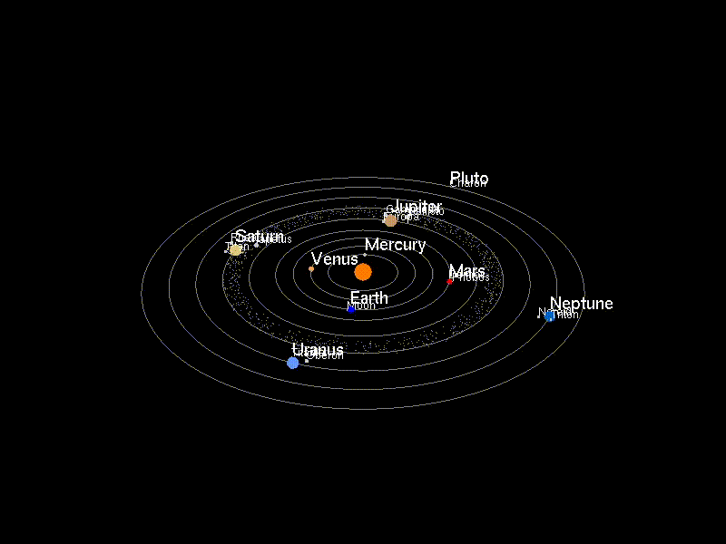

# solar_system


This cross-platform C++ project leverages OpenGL to create a visually engaging 3D representation of our solar system. The simulation depicts the planets and their moons, each rendered with their distinct colors and orbiting their respective celestial bodies.

## Prerequisities
### Windows (MSVC)
1. Microsoft Visual Studio with C++ workload
2. Git for windows

### Linux
1. git, cmake, gcc installed 

## Building

### Windows (MSVC)

From Visual Studio Developer Command Prompt:
```
cd /d %homedrive%%homepath%
git clone https://github.com/mavstuff/solar_system.git
cd solar_system
git submodule init
git submodule update
mkdir build
cd build
cmake ..
cmake --build .
Debug\solar_system.exe
```

### Linux (GCC)
From shell terminal:
```
git clone https://github.com/mavstuff/solar_system.git
cd solar_system
git submodule init
git submodule update
mkdir build
cd build
cmake ..
cmake --build .
./solar_system
```

### Author

**Artem Moroz**

* [github/mavstuff](https://github.com/mavstuff)
* [artemmoroz.org](https://artemmoroz.org)

### License

Copyright © 2025, [Artem Moroz](https://github.com/mavstuff).
Released under the [MIT License](LICENSE).